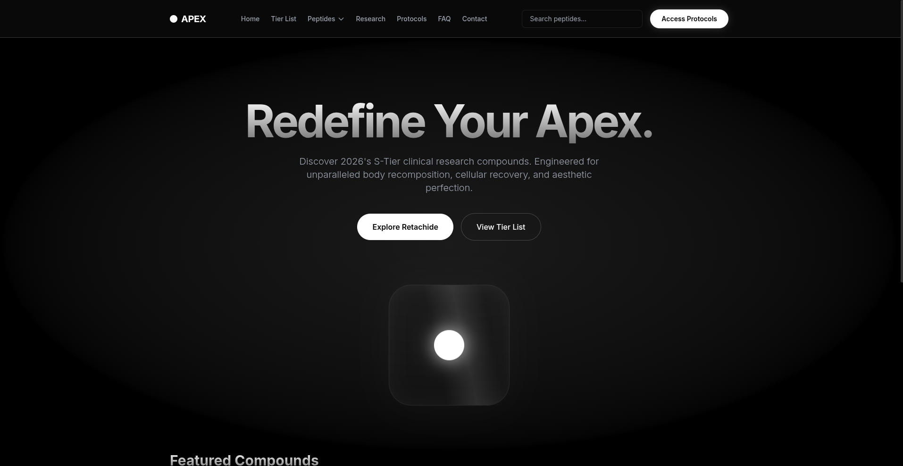

# APEX Synthetics — The 2026 Protocol

A premium single-page web application showcasing S-Tier clinical research compounds. Designed with a **liquid glass aesthetic**, deep OLED black backgrounds, and razor-sharp highlight details.

  

---

## 🚀 Features

- **Hash‑based routing** – Each peptide and section has its own URL hash, enabling deep linking and browser navigation.
- **Liquid glass card system** – Subtle gradient borders, inner highlights, and hover lift effects.
- **Dedicated pages for 15+ peptides** – Retachide, Melanotan 2, BPC 157, GHK‑Cu, IGF LR3, and more.
- **Tier list** – S‑Tier to C‑Tier with a comparison table.
- **Research section** – Efficacy bar charts and study summaries.
- **Protocols** – Ready‑to‑use stacking protocols for cutting, healing, longevity, etc.
- **FAQ accordion** – Interactive answers about legality, storage, and dosing.
- **Contact form** – Simple inquiry form.
- **Search functionality** – Quick search across peptide content.
- **Fully responsive** – Mobile‑first layout with hamburger menu.
- **No build tools required** – Pure HTML, Tailwind CDN, and vanilla JavaScript.

---

## 📄 Pages Included

| Page / Section       | Description |
|----------------------|-------------|
| Home                 | Hero with floating abstract mockup and featured compounds. |
| Tier List            | Official tier ranking and comparison table. |
| Retachide            | Detailed info, dosing, side effects, stacking. |
| Melanotan 2          | Tanning peptide with appetite suppression. |
| BPC 157              | Tissue repair and recovery. |
| CJC1295 + Epitalon   | GH optimization and longevity. |
| IGF LR3              | Muscle hypertrophy. |
| GHK‑Cu               | Copper peptide for skin and anti‑aging. |
| Oxytocin             | Anxiety reduction and social bonding. |
| TB‑500               | Tissue regeneration. |
| Semax                | Cognitive enhancement. |
| Selank               | Anxiolytic and immune support. |
| MOTS‑c               | Metabolic health. |
| SS‑31                | Mitochondrial protection. |
| AOD9604              | Fat loss fragment. |
| Tesamorelin          | Visceral fat reduction. |
| Ipamorelin           | GH secretagogue. |
| Research             | Clinical data and efficacy charts. |
| Protocols            | Stacking recommendations. |
| FAQ                  | Common questions. |
| Contact              | Inquiry form. |

---

## 🛠️ Technologies Used

- **HTML5** – Semantic structure.
- **Tailwind CSS** – Utility‑first styling via CDN.
- **Vanilla JavaScript** – Routing, accordion, search, mobile menu, back‑to‑top.
- **Google Fonts** – Inter typeface.

---

## 🚀 Getting Started

No installation or build process is needed.

1. Clone or download the repository.
2. Open `index.html` in any modern web browser.
3. Browse through the peptide pages using the navigation menu.

That’s it!

---

## ⚠️ Disclaimer

This project is for **educational and demonstration purposes only**.  
The compounds described are **not approved for human consumption** and are intended solely for research.  
Always consult a qualified healthcare professional before considering any experimental substance.

---

## 📄 License

This project is licensed under the **MIT License**. See the [LICENSE](LICENSE) file for details.

---

## 🙏 Acknowledgements
- yes this readme was made by ai since im too lazy to write one myself😭
- Design inspired by modern luxury and clinical aesthetics.
- Built with [Tailwind CSS](https://tailwindcss.com/).
